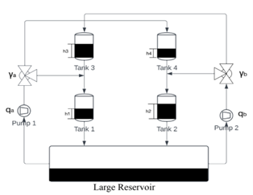

 # Model Predictive Control
 ### Comparisons of LSQ DMC, QDMC, Constrained QDMC, Robust constrained QDMC and Neural MPC

*The inspiration for this repo originated from the course - Process Systems Modelling taught by Professor Fernando Lima at Carnegie Mellon University in the Spring of 2022. The idea grew outside the course, at which it was a much simplified version and I am thankful to him for instilling within me his trust and guiding me in my endeavour even outside the classroom.*

The optimal control design of systems is an important problem of control theory. A powerful way of investigating this problem is to use model predictive controllers (MPCs) which are known to be popular in many fields of applications (Qin and Badgwell, 2003).

I try to investigate the control schematics of the Quadratic Tank Process which involves 4 interconnected water tanks. Each of these tanks has an orifice located in the bottom so that fluid may drain by way of gravity. These orifices are removable and constructed with various diameters allowing the system to have different sets of parameters. In this arrangement, the tanks are split into two vertical sets so that one tank is positioned over another allowing fluid to drain from one tank to the second and then finally to a basin for recycling. The fluid flow from two positive displacement pumps is split between an upper tank and the opposing set's bottom tank. The main focus of this system is to mandate the height of fluid in the bottom two tanks via a control system. This control system uses the tank's current fluid height as input to make proper height adjustments by varying the output of pump speed, which imparts an inlet flow to the tanks.

The study is of two inputs (pump flow rates) which can be manipulated to control the two outputs (Tank 1 and Tank 2 levels). The system exhibits interacting multivariable dynamics because each of the pumps affects both of the tank levels.

 

