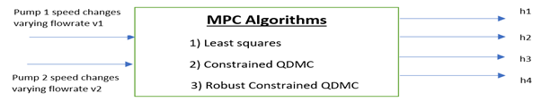

 # Model Predictive Control
 #### Comparisons of LSQ DMC, QDMC, Constrained QDMC, Robust constrained QDMC and Neural MPC
 

*The inspiration for this repo originated from the course - Process Systems Modelling taught by Professor Fernando Lima at Carnegie Mellon University in the Spring of 2022 and later with the Non Linear Programming Course by Professor Lorenz T Biegler in Fall 2022. The idea grew outside the course, at which it was a much simplified version and I am thankful to my teachers for instilling within me their trust and guiding me in my endeavour even outside the classroom.*

The optimal control design of systems is an important problem of control theory. A powerful way of investigating this problem is to use model predictive controllers (MPCs) which are known to be popular in many fields of applications (Qin and Badgwell, 2003).

I try to investigate the control schematics of the Quadratic Tank Process which involves 4 interconnected water tanks. Each of these tanks has an orifice located in the bottom so that fluid may drain by way of gravity. These orifices are removable and constructed with various diameters allowing the system to have different sets of parameters. In this arrangement, the tanks are split into two vertical sets so that one tank is positioned over another allowing fluid to drain from one tank to the second and then finally to a basin for recycling. The fluid flow from two positive displacement pumps is split between an upper tank and the opposing set's bottom tank. The main focus of this system is to mandate the height of fluid in the bottom two tanks via a control system. This control system uses the tank's current fluid height as input to make proper height adjustments by varying the output of pump speed, which imparts an inlet flow to the tanks.

The study is of two inputs (pump flow rates) which can be manipulated to control the two outputs (Tank 1 and Tank 2 levels). The system exhibits interacting multivariable dynamics because each of the pumps affect both of the tank levels.

 

### The Data modelling Algorithm works in the following way :
 

 

### 1 . Modeling and simulation of the ODE system
The system is designed to have two tank heights (h1, h2) as output, four tank heights (h1, h2,h3, h4) as state variables, and two pump volumetric flow rates (qa, qb) as inputs. The nonlinear ODE model of the four-tank system is obtained using mass balance equation and Bernoulli’s law.

### 2 . Representing the ODE system in the continuous linear state-space form
State-space form is a mathematical model of a physical system as a set of inputs, outputs and state variables related by differential equations. State variables are variables with values that change over time, depending on the values they have at given time and on the externally imposed values of input variables. Output variables values depend on the values of the state variables. The state-space representation can be expressed in continuous or discrete form which are discussed below and in the next section.

From the ODE system, it can be represented as a continuous linear state-space form:

 x'=Ax'+Bu'   
 y'=Cx'+Du' 

### 3 . Converting the ODE system to discrete-time state-space representation
The system is then converted to discrete-time state-space form as follows, in which φ and Γ are discrete linearization representations.

x(k+1) = φx(k)+Γu(k)  
y(k) = Cx(k)+Du(k)

φ and Γ are calculated from A, B, I matrices and discrete time Δt using the numerical equations, while C and D remain unchanged. 

### 4 .  Creating the Step-response model
The finite step response model is obtained by making a unit step input change to a process operating at a steady-state. The steady state solution of the system is
found either by solving the ODE's simultaneously for points where derivatives are collectively zero or from experimental investigations which show points of stability which are usually the initial points.

### 5 .  Checking the system dynamics
To check whether the system is controllable in a non minimum phase environment by fixing h_3 and  h_4 the control (ctrl) package in python was used which required as its input the φ and Γ matrices and returned a full rank controllability matrix ensuring that the system is observable and controllable.
Minimum phase systems are those which have zero poles in the transfer function dynamics while finding the gain matrix. (Denominator zero) and are inherently very unstable.

### 6 .  Setting up the LSQ-DMC

The value of different predictive output ŷ(k) is initially calculated by the equation:  

$$\left( ŷ(k)\right) = \left(\sum_{i=1}^{N-1} s_i Δu(k-i) +s_{N}u(k-N)\right)$$

This equation assumes that all step response coefficients which are larger than step N are equivalent to N, which means that the system already reaches steady state. Therefore, part of the equation is simplified to sN u(k-N). Besides, the difference between measured output and predictive output is named disturbance.

$$d(k)=y(k)-ŷ(k)  $$                                                        
                                                                
$$\left( ŷ^c (k+j)\right)=\left(\sum_{i=1}^{j} s_i Δu(k-i+j) +\sum_{i=j+1}^{N-1}s_i Δu(k-i+j) + s_N u(k-N+j)+d ̂(k+j)\right)$$

$$\left( Ŷ^c=S_f Δu_f+S_past Δu_past+s_N u_p+d \right)$$ ̂

Part of the equation is simplified to s_N u(k-N). Besides, the difference between measured output and predictive output is named disturbance, as shown in Equation (6), assuming the disturbance is constant at different times. And the “corrected predictive” output is equal to the disturbance added to the model prediction output ŷ(k).

 In which 
 

 Ŷc  =  Corrected predicted output   Sf Δuf  = Effect of current or future control moves Spast Δupast +  sN up= Effect of past control moves  d ̂ = Predicted disturbances}

〖ŷ_1^  (k)〗^ =S_f11 Δu_f1+S_f12 Δu_f2+S_past11 Δu_past1 〖+S〗_past12 Δu_past2+s_N11 u_p1+s_N12 u_p2                  
〖ŷ_2^  (k)〗^ =S_f21 Δu_f1+S_f22 Δu_f2+S_past21 Δu_past1 〖+S〗_past22 Δu_past2+s_N21 u_p1 〖+s〗_N22 u_p2                    
E_1=r_1-[S_past11 Δu_past1 〖+S〗_past12 Δu_past2+s_N11 u_p1  +s_N12 u_p2+d ̂_1]      
E_2=r_2-[S_past21 Δu_past1 〖+S〗_past22 Δu_past2+s_N21 u_p2  +s_N22 u_p2+d ̂_2]          

We initialize input vector, output vector, state vectors, past inputs, predicted disturbance, error and predicted output. Since the system started from the steady state, it is necessary to initialize the two input vectors to the first pump volumetric flow rate and the second pump volumetric flow rate respectively. The same work should be applied to the state vectors, output vectors and all of the above matrices. All vectors should be multiplied by the initial steady state values, except that the error and predicted disturbance are initialized to zero. 

The final step is to set a for loop for dynamic matrix control. The objective function is defined as the sum of the squares of the predicted errors on the first and the second output respectively, and the control moves with the first input and the second input respectively.

The quadratic terms in objective function is written in a matrix-vector form:
f_obj=∑_(i=1)^P 〖(r_1 (k+i)-ŷ_1^c (k+i))〗^2+∑_(i=1)^P 〖〖(r〗_2 (k+i)-ŷ_2^c (k+i))〗^2+w∑_(i=0)^(M-1) 〖(Δu_1 (k+i))〗^2+w∑_(i=0)^(M-1) 〖(Δu_2 (k+i))〗^2           
f_obj=〖(E_1^c)〗^T E_1^c+〖〖(E_2^c)〗^T E_2^c〗_^  +〖(〖Δu〗_f1^ )〗^T W〖Δu〗_f1^ +〖(〖Δu〗_f2^ )〗^T W〖Δu〗_f2^                                                        
The objective function is differentiated with Δu_f1 and Δu_f2 respectively and then set to zero. 
E_1 and E_2  are the free responses which are the unforced errors and cannot be changed.  In the for loop, it is also necessary to update the error and input past (Upast) information as for loop number increases. When the for loop finishes, MSE is calculated to verify the DMC control effect. 
Δu_f1=〖(〖S_f1〗^T S_f1+W)〗^(-1) 〖S_f1〗^T E_1                                                                                                           
Δu_f2=〖(〖S_f2〗^T S_f2+W)〗^(-1) 〖S_f2〗^T E_2 

### 7 . Set up of Quadratic constrained dynamic matrix control (QDMC)
In on-line applications, the moves computed using an LSQ-DMC may not be implementable due to process operating limit violations. 

Three types of process constraints are usually encountered: 
Manipulated variable constraints:  valve saturation. The controller must be able to predict future violations and prescribe moves that would keep these variables within bounds 
Controlled variable constraints: overshoots in the controlled variables past allowable limits must be avoided 
Associated variables: key process variables which are not directly controlled but that must be kept within bounds. 
The controller must be able to predict future violations and prescribe moves that would keep these variables within bounds.  
 

The least squares objective function used in the DMC implemented earlier can be modified to capture physical system constraints to give it the Quadratic minimization problem form:

min: f_obj=〖〖Δu〗_f^ 〗^T H〖Δu〗_f^ +C^T  〖(〖Δu〗_f^ )〗^   
H=〖(〖S_f〗^T S_f+W)〗^; 〖〖    C〗^T=(E_^c)〗^T 〖Δu〗_f^ 
         subject to: 
Physical hard constraints:   umin  ≤  u(k+1)   ≤umax ;      Formulated as Aqp〖Δu〗_f^ ≤Bqp
                       Velocity constraints without violation:   〖Δu〗_f^ min  ≤〖   Δu〗_f^   ≤〖  Δu〗_f^ max 
                      
The cvxpy package in python is used extensively to hold the QP minimization problem and addition of modified right handed one sided inequality constraints. In the presence of non-minimum phase behavior of controlled and associated variables much improvement in performance is achieved by moving the "constraint window" further down in the horizon. The reason is that any projected violation inside the "constraint window" is handled rigorously by the QP, not unlike a tightly tuned controller. Therefore, if the QP is asked to correct for violations in the earlier projections, severe input moves might be required in the face of non-minimum phase characteristics. 
Thus, its robust characteristics guarantees reliability of the controller over the whole operating region. 

### 7 . Incorporating Noise in recieved signals from the outputs during step tests:
A fundamental question about MPC is its robustness to model uncertainty and noise. When we say that a control system is robust we mean that stability is maintained and that the performance specifications are met for a specified range of model variations and a class of noise signals (uncertainty range). To be meaningful, any statement about “robustness” of a particular control algorithm must make reference to a specific uncertainty range.
In our application of real time data we assume that the noise inserted into the system is Gaussian with specific outliers to capture the noisy sensor data available from industrial setups and the failure to ensure that the system remains undisturbed while gathering the step test data.
### A standard Gaussian random variable w takes values over the real line and has the probability density function:
〖noise〗_sp=1/√(2π σ〖^2〗) exp(〖(x-μ)〗^2/(2σ〖^2〗))+vsp

### 8 . Extended Kalman Filters (EKF)
A Kalman filter estimates $x_t$ by solving the optimization problem

\begin{array}{ll}
\mbox{minimize} & \sum_{t=0}^{N-1} \left( 
\|w_t\|_2^2 + \tau \|v_t\|_2^2\right)\\
\mbox{subject to} & x_{t+1} = Ax_t + Bw_t,\quad t=0,\ldots, N-1\\
& y_t = Cx_t+v_t,\quad t = 0, \ldots, N-1,
\end{array}

where $\tau$ is a tuning parameter. This problem is actually a least squares problem, and can be solved via linear algebra, without the need for more general convex optimization. Note that since we have no observation $y_{N}$, $x_N$ is only constrained via $x_{N} = Ax_{N-1} + Bw_{N-1}$, which is trivially resolved when $w_{N-1} = 0$ and $x_{N} = Ax_{N-1}$. We maintain this vestigial constraint only because it offers a concise problem statement.

### 9 . Extended Kalman Filters (EKF)
